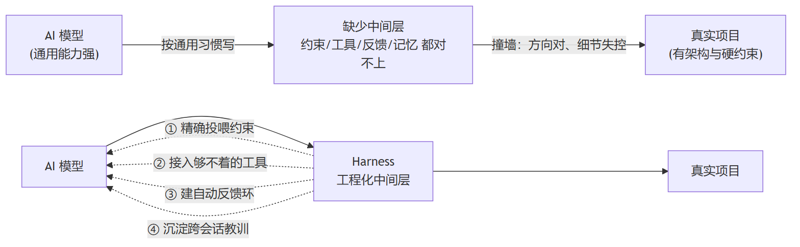
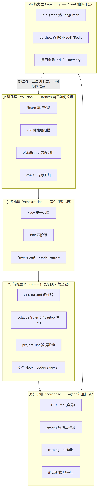
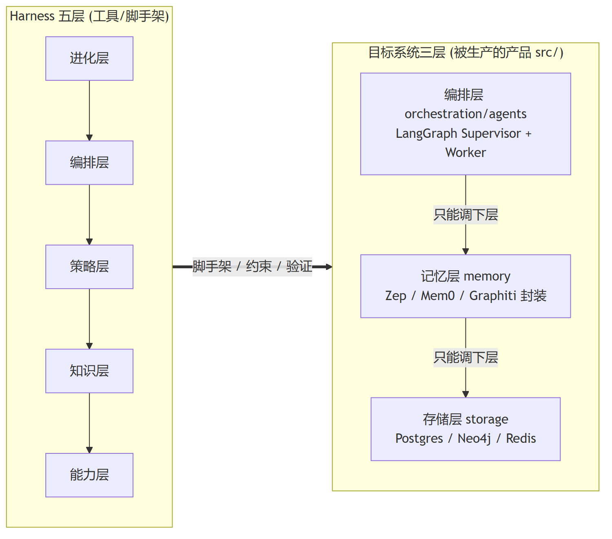
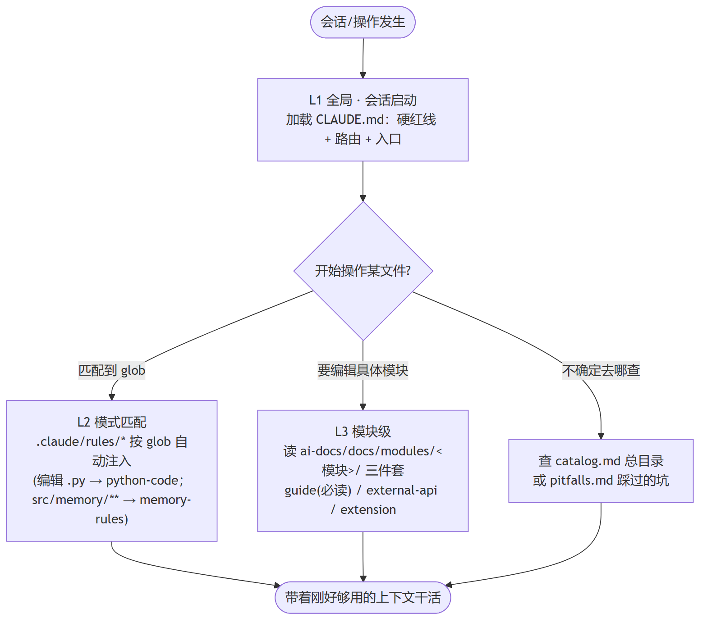
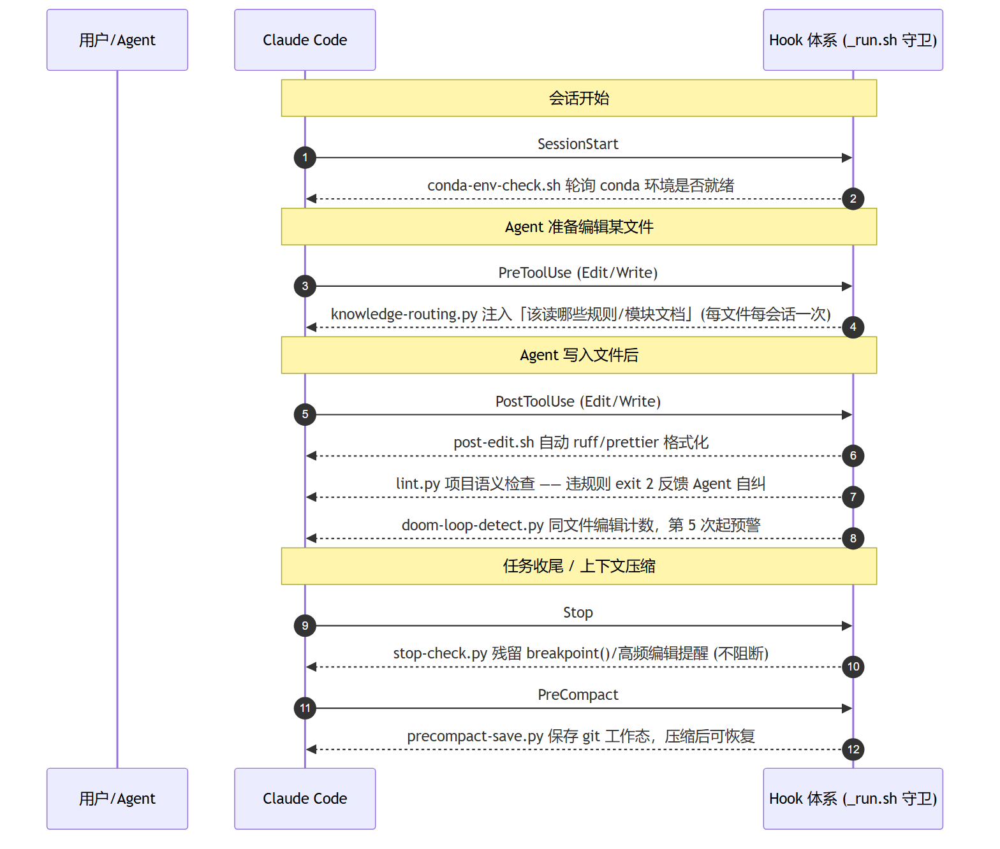
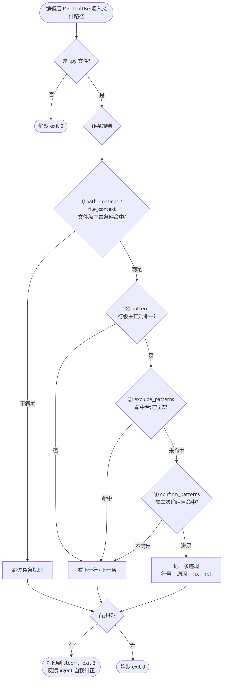
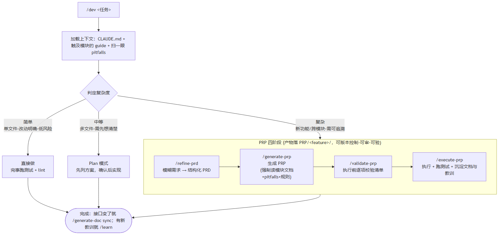
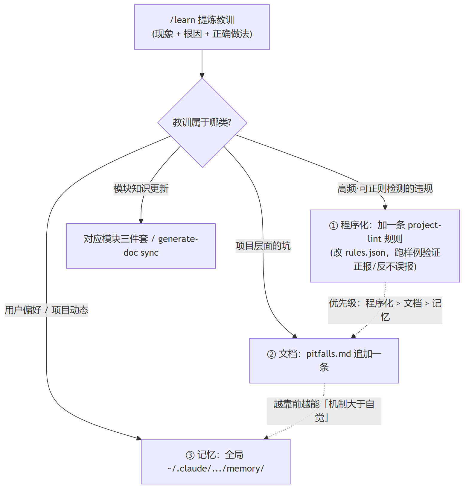
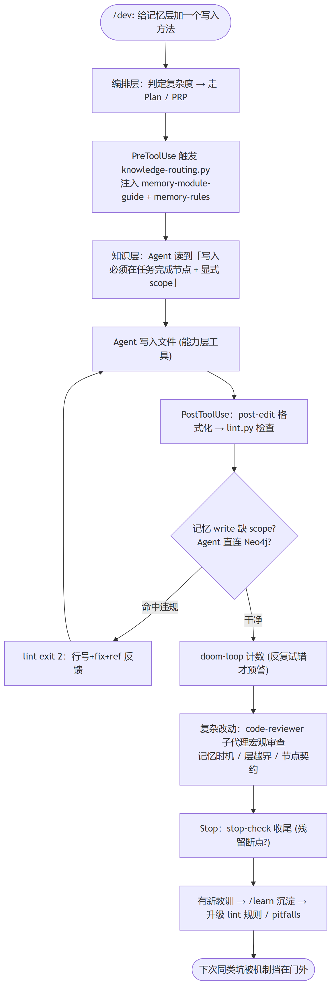

> 这是一套**自用的 Claude Code Harness**——不是什么上线产品，而是夹在「AI 模型」和「真实项目」中间的一层工程脚手架，专门用来稳定地产出一个**多 Agent 协作系统**。
>
> 文中所有框架图、流程图都按仓库里钩子 / 引擎的**真实行为**绘制。适合这样的你：想给自己的项目搭一层「能精确控制 AI 编码」的中间层，却又不知道该分哪几层、每层放什么。

## 一、先说问题：AI 编码工具的那堵墙

现在的 AI 编码工具，在写样板、查 API、排小 Bug 上已经「大体好用」。但一落到有架构约束的真实项目，就会撞上同一堵墙：**大方向能跑通，精确控制难**。

这不是模型不够聪明，而是**模型和项目之间缺一个工程化中间层**。失控通常是四类：

| 失控层面 | 现象 | 在「多 Agent + 记忆」领域的具体表现 |
| --- | --- | --- |
| 约束没投喂 | 项目规范默认不在上下文里，模型按通用习惯写 | Agent 直连 Neo4j 绕过记忆层封装；记忆写入不带 scope |
| 工具够不着 | 项目工具链之外的操作干不了 | 起 LangGraph 图、连 Postgres/图谱查运行态 |
| 写完没法验证 | 缺自动反馈环，对错只能等人跑 | 记忆写入时机错了，要等图谱抖动才发现 |
| 坑会再踩 | 教训不持久化，跨会话反复犯 | 「每条消息后刷图谱」纠正完，下次又犯 |

**Harness 干的就是这四件事**：把项目约束精确投喂、把够不着的工具接进来、给产出建自动反馈环、把跨会话教训沉淀成可复用资产。

它的核心命题不是「让 AI 更聪明」，而是——

> **让 AI 在每个时刻都刚好看到它需要的信息、调得动它需要的工具、拿得到它需要的反馈。**

这就是**上下文工程（Context Engineering）**。它有一条硬前提：**上下文窗口有限**，不能也不该全量加载，必须按需、渐进地把最相关的信息送达。整套架构都是围绕这条前提设计的。

## 二、五层架构总览（框架图）

为了同时回答五个**正交**的关切，Harness 拆成五层，每层只回答一个问题，互不干扰、可单独演进：

**为什么要正交分层？** 因为每层可以独立替换、独立演进——换 lint 规则不影响 PRP 流程，改 PRP 不动能力层。唯一横跨两层的常驻文档是 `CLAUDE.md`：它的「禁令」属策略层，「信息/路由」属知识层。

| 层 | 回答的问题 | 本仓库里它是什么 |
| --- | --- | --- |
| 能力层 Capability | Agent **能做什么** | `.claude/skills/`：run-graph、db-shell |
| 知识层 Knowledge | Agent **知道什么** | `ai-docs/` + `CLAUDE.md` |
| 策略层 Policy | 什么**必须/禁止** | `.claude/rules/` + `hooks/` + `project-lint` |
| 编排层 Orchestration | 怎么**组织执行** | `.claude/commands/`（/dev、PRP 四阶段） |
| 进化层 Evolution | Harness **自己怎么改进** | `.claude/skills/evolution/` + `evals/` |

## 三、两个「依赖方向」别搞混（框架图）

这套体系里有**两个**自上而下的依赖方向，初看容易混，画出来就清楚了：

- **左边**是 Harness 本身的五层（上面那张图的纵深）；
- **右边**是 Harness 要去**生产的目标系统**——一个三层运行架构的多 Agent 系统。

目标系统那条依赖方向是**硬红线**：存储 ← 记忆 ← 编排，**只能上层调下层，禁止反向/跨层依赖**。运行态（LangGraph Checkpointer）进 Postgres，长期记忆走 Graphiti/图谱库，两者**分离存储**。Harness 的策略层（rules + lint）存在的意义，正是把这条红线变成「机制」而不是「自觉」。

下面逐层拆开看，每层都配一张流程图说明它**怎么运转**。

## 四、能力层：Agent 的手脚

让 Agent 能「跑起来看」，而不只读写文件。本仓库只造领域专属的两个，通用能力（飞书、跨会话记忆）直接复用宿主全局技能，**不重复造**：

| 技能 | 作用 |
| --- | --- |
| `run-graph` | 起 LangGraph 编排图、跑一次输入、查 Checkpointer 运行态 |
| `db-shell` | 连接并查询 PostgreSQL / Neo4j·FalkorDB / Redis（连接串走 `.env`） |

> 设计取舍：能力层最容易膨胀。判断「该不该新建 Skill」的标准是——操作反复出现 / 有可标准化的流程 / 生成代码有固定模板 / 需团队共享最佳实践。够不上就不造。

## 五、知识层：让 Agent「刚好知道」当前要知道的

核心矛盾：**项目知识喂不完，窗口装不下**。解法是**渐进式加载**，只在需要时加载那一份。

几条关键设计：

- **模块文档三件套**：`<模块>-module-guide.md`（内部架构，编辑前必读）· `-external-api.md`（对外接口/禁止事项，跨模块调用时查）· `-extension-guide.md`（扩展点）。当前已填 `memory` / `orchestration`。
- **CLAUDE.md 必须精干**：前沿 LLM 能可靠遵循的指令大约 150–200 条，写越多遵守率越低。所以它是「最核心 5–10 条 + 索引」，不是百科——细则全部下沉到 rules 和 ai-docs，按需加载。
- **`/generate-doc`** 负责从源码生成/同步文档，专治「代码改了文档没跟上」。

## 六、策略层：知道 ≠ 做到，靠机制不靠自觉

这是整套 Harness 最硬核的一层。核心思想：**Agent 知道规则，不等于会遵守规则**。所以不靠它自觉，而是用机制兜底——规则自动加载、编辑后自动检查、重复犯错自动预警、审查自动触发。

### 6.1 Hook 体系：嵌进 Claude Code 生命周期（流程图）

6 个 Hook 注册在 `.claude/settings.json`，覆盖一次编辑回合的全部关键时点。下面这张时序图就是一个真实编辑回合里它们的触发顺序：

两条贯穿所有 Hook 的铁律：

1. **成功静默、失败冗余**——没事不刷屏，出事就把行号+原因+修复建议+引用一次性喂给 Agent。
2. **守卫包装**：所有 Python hook 都经 `_run.sh` 调用，它依次找 `python/python3/py`，都没有就静默 `exit 0`——保证刚 checkout、还没装 Python 的环境**不会每次编辑都刷错**。

代码佐证：守卫见 `.claude/hooks/_run.sh:6-11`；死循环预警的「第 5 次首警、之后每 +3 次再警」逻辑见 `.claude/hooks/doom-loop-detect.py:57`。

### 6.2 数据驱动的 project-lint：四层过滤流水线（流程图）

`project-lint` 抓的是 **ruff/mypy 查不到的项目语义违规**——比如「记忆写入缺 scope」「Agent 直连存储」「下划线前缀成员」「裸 except」。它的精髓是**规则即数据**：规则全写在 `rules.json`，引擎 `lint.py` 不随规则变化。新增一条规则只改 JSON，不动引擎。

引擎对每条规则跑一条**四层过滤流水线**，逐层收窄、压低误报：

这套流水线和退出语义直接对应代码 `lint.py:62-89`（四层过滤循环）与 `lint.py:117-120`（违规 exit 2、无违规 exit 0）。它同时支持两种调用：**无参** = Hook 模式从 stdin 读工具负载；**带文件参数** = CLI 测试模式，方便回归。

### 6.3 规则 + 子代理

- **CLAUDE.md 硬红线**（4 条全局禁令，每次会话常驻）：跨层反向依赖 / 每条消息刷图谱 / 默认 user 作用域 / secrets 入库。
- **5 条规则**，由 frontmatter 决定加载时机：`project-root`、`knowledge-routing` 是 `alwaysApply`（常驻）；`python-code` 命中 `**/*.py`；`memory-rules`、`orchestration-rules` 命中各自 `src/**` 路径。
- **code-reviewer 子代理**：lint 管单行能正则化的违规，子代理管**需要推理的宏观问题**——记忆写入时机、层间越界、节点契约、async/生命周期，输出 BLOCK/WARN/INFO 分级报告。

> 一句话记住分工：**rules 注入约束、lint 抓单行违规、code-reviewer 做宏观推理审查**，三者粒度递增、互补不重叠。

## 七、编排层：复杂任务工程化（流程图）

核心洞察：**计划与执行分离**。`/dev` 是统一入口，先判定复杂度，再路由到对应路径——倾向更轻的一档，发现复杂度超预期再升级：

**Plan 模式 vs PRP** 的区别：Plan 是「想清楚再做」的会话内临时计划，适合中等任务；PRP 是「想清楚、写下来、审完再做、做完验证、沉淀知识」的持久化流程，产物可版本控制，适合复杂功能。`/generate-prp` 这一步**强制**读相关模块文档 + pitfalls + 规则——把「先看约束再动手」固化进流程，而不是寄望 Agent 记得。

## 八、进化层：Harness 自己也在进化（流程图）

Harness 不是搭完就不动，它要能自我体检、自我改进。核心是 `/learn`——把会话里的纠错/反馈/新约定沉淀成**可复用资产**。沉淀位置按一条优先级路由：

为什么是「程序化 > 文档 > 记忆」这个优先级？因为越靠前的形式越**不依赖 Agent 自觉**：lint 规则会强制执行，文档要 Agent 主动读，记忆只是偏好提示。能机械检测的坑，就升级成 lint 规则，让它「这次错、下次也错不了」。

配套还有两件自检/回归工具：

- **`/gc`**（跑 `gc_scan.py`）：体检 harness 自身健康度——markdown 链接失效、`modules.json` 目录缺失、`settings.json` 引用的 hook 脚本缺失。
- **`evals/`**：给 AI 行为写的「单元测试」。lint 保「单次改动对」，eval 保「整套规则能让 AI 一次做对」，两者不重复。

## 九、把图串起来：一个真实编辑回合

最后用一张端到端流程图，把前面各层的机制在「Agent 改 `src/memory/` 里一个文件」这个真实回合里串起来——你会看到五层是如何协同的：

这张图就是整套 Harness 的「价值闭环」：**知识层让它知道**、**策略层逼它做到**、**能力层让它够得着**、**编排层让它有章法**、**进化层让今天的教训变成明天的护栏**。

## 十、心法小结：什么照搬、什么替换

如果你想给自己的项目搭一套同款，记住哪些是**领域无关**（直接复用）、哪些**领域相关**（按项目替换）：

| 直接复用（领域无关） | 按你的项目替换（领域相关） |
| --- | --- |
| 五层目录骨架 | 能力层技能（本仓库 = run-graph / db-shell） |
| CLAUDE.md 拆分方式（核心 + 索引） | 规则内容（本仓库 = Python + 记忆约束） |
| 渐进式加载 L1→L3 | `project-lint/rules.json` 的具体规则 |
| 规则 frontmatter 机制 | 模块三件套的对象 |
| 数据驱动 lint 引擎 | CLAUDE.md 的硬红线 |
| Hook 生命周期 + 守卫 | —— |
| PRP 四阶段 / 进化层 / code-reviewer | 复用宿主全局资产，不重复造 |

最后留三句作为「心法」：

1. **上下文是稀缺资源**——能不加载就不加载，按需、渐进、最相关优先。
2. **机制大于自觉**——能用 hook/lint 强制的，绝不靠 Agent 记得。
3. **教训要沉淀成资产**——优先沉淀成可执行的程序（lint 规则），其次文档，最后记忆。

> 这是一套**「右尺寸的种子」**：不追求一次复刻成熟 harness 的全部资产，而是覆盖五层骨架，随真实代码逐步充实。`src/` 目前为空，但骨架已经准备好接住每一行未来的代码。

---

*本文基于该 harness 仓库当前状态绘制（2026-06-25），所有流程图均对应实际的钩子与引擎实现。*
