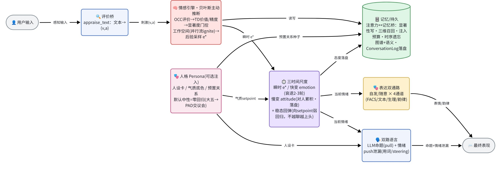
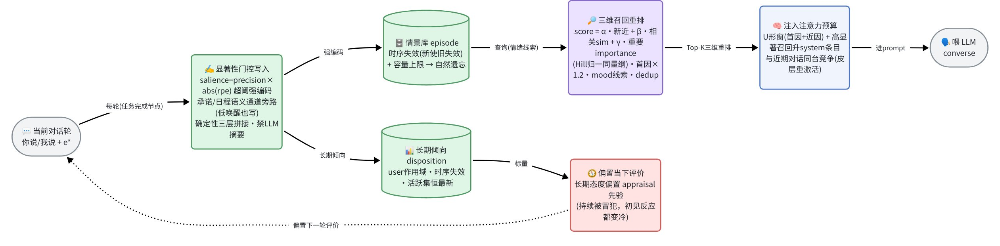
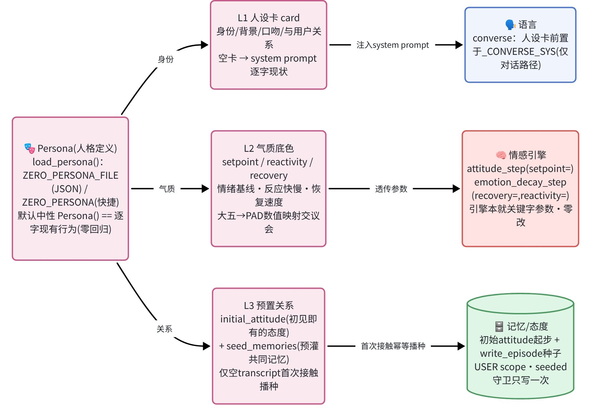
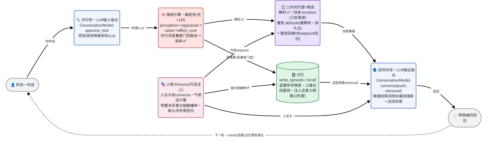

> 不是让模型"扮演"情绪，而是让情绪真实地参与生成。这篇文章想讲清楚的，不只是"做了什么"，而是**每一处为什么这么设计、当时在权衡什么、踩了哪些坑又怎么修回来的**。

## 从一个让我不甘心的问题说起

跟今天的大模型聊天，情绪这件事通常落在两个极端。

一种是**没有情绪**：无论你夸它还是骂它，它都端着同一副温吞的客服腔，永远在道歉、永远在"理解你的感受"。另一种更尴尬，是**演情绪**：你给它一句 system prompt "请表现得很生气"，它就开始字面意义上的表演——"我现在非常愤怒！😡"——像个用力过猛的群众演员。

[Zero](https://github.com/WizardHeHeJun/Zero) 这个项目想做的，是让数字人**带着情绪说话**：有脾气、会记住你、被持续冒犯会真的变冷，但道个歉又能缓过来。

但在动手之前，得先回答一个更根本的问题——**这件事，能不能靠把 LLM 的提示词写得更花哨来解决？** 我的结论是不能，而这个结论直接决定了整个项目的架构。

## 设计的起点：为什么不能只靠"调教 LLM"

第一个理由，来自 LLM 和人类表达之间**机制性的、可度量的差异**——这不是"还不够像"，而是生成原理决定的结构性偏移：

- LLM 优化的是"下一个词的条件概率"（似然最大化），本质是在拟合语料的**形式分布**，而人类表达是**意图驱动**的（Grice 合作原则、言外之意）。目标函数根本不同。
- 这种差异是可以被统计抓出来的"机器指纹"：人类句长复杂度起伏更大，LLM 更平滑可预测；对齐训练（RLHF）还会进一步**收窄分布**，让输出趋向"安全、中庸、平均"，并带来谄媚和模板化。

换句话说，越是用提示词去"指挥"一个本就倾向中庸的语言模型表演情绪，越是在和它的训练目标对抗，结果就是那个用力过猛的群演。**情绪不该从语言模型里"挤"出来，而该有一个独立的来源。**

第二个理由更要命，是诚实问题：**情感到底能不能被数学建模？** 我把"建模"拆成五个递进层级，分别去查了文献：

| 想建模到哪一层 | 有没有成熟数学 |
| --- | --- |
| 表示结构（情绪坐标、几何） | ✅ 成熟（环状模型、PAD） |
| 预测动态（随时间演化、相互作用） | ✅ 成熟（Gottman 动力系统、随机微分方程） |
| 从认知评价推断 | ✅ 可生成可解释（OCC 评价理论 + 概率逻辑） |
| 解释生理生成机制 | ✅ 有统一框架（自由能 / 主动推断） |
| **复刻主观体验（qualia）** | ❌ 原则上未解（意识"难问题"） |

结论是：**前四层都有可用的数学，第五层撞上的是哲学上未解的"难问题"。** 这给了项目一条清晰的、也是诚实的边界——Zero 建模的是情感的**功能投影**（坐标、轨迹、预测误差、表达后果），它能描述、预测、生成、干预情绪的功能结果，但**不声称、也做不到"让机器真的感受到"**。这条边界后面会反复出现：每加一个机制，我都只敢说"更忠实地拟合了情感的影子"，而不是"更接近感受本身"。

这两个理由合起来，定下了最核心的架构决策：**做一套独立于 LLM 的、确定性的情感引擎，让它专门负责"情绪从哪来、怎么变"；LLM 只在两端跟它结合——入口把话读成情绪，出口被情绪调制着说话。**

## 设计一：情绪怎么"产生"——一条贝叶斯流水线

既然要独立造引擎，第一个问题就是：一句话进来，情绪怎么算出来？

我没有用"查表给情绪"那种做法，而是借鉴了大脑处理情感的三套被研究得最透的理论，把它们**统一成一条贝叶斯流水线**：

1. **OCC 评价理论**贡献"理性先验"——这件事合不合我的目标、符不符合我的标准、对象讨不讨我喜欢，给出一个情绪的初始猜测；
2. **强化学习的奖赏预测误差（TD-RPE）**贡献"价值流"——这比我预期的好还是差，在线学习；
3. **自由能 / 主动推断**贡献"后验采样"——把各路证据按"精度（确信度）"加权融合，再采样出此刻的情绪。

为什么是这三个拼一起？因为它们恰好覆盖了"先验 → 证据 → 后验"这条贝叶斯链，而且自由能框架里有一个特别关键的设计抓手：**精度加权的预测误差，就是情感强度的旋钮**。高精度的误差被放大（凸显、紧迫），低精度的被忽略——这在大脑里由神经调质（多巴胺等）编码。把"精度"作为一等公民贯穿全系统，后面几乎所有融合、竞争、抗干扰的设计都从这一个抓手长出来。

具体到一句话进来：先经**评价桥**反推成一个效价-唤醒坐标 `(v, a)`（夸奖是正效价，挑衅是负效价高唤醒），作为刺激喂给引擎；引擎算出此刻的情绪后，分两路外化为语言和表情。采样这一步还特意保留了随机性——所以同一句话也会有细微的反应波动，而不是机械复读。

## 设计二：为什么是"并行流竞争"，而不是"几个脑区求平均"

这一块是我改得最狠的一处，也最能说明"设计思路"是怎么被文献逼着修正的。

最早画的架构图很直觉：6 个脑区当成 6 个功能模块，齐刷刷并行涌进一个"整合器"求平均，输出情绪。看着很对称、很工程。但我去查了 30 篇神经科学文献，发现这个直觉图有三个硬伤：

- **"脑区 = 情绪模块"是假的**。Barrett 的建构情绪论指出情绪没有单一神经指纹（"恐惧"由多变的神经群以多种模式产生）；Pessoa 的双重竞争模型也说脑区是多功能的。把"杏仁核 = 恐惧 agent"硬编码进架构，在解剖学上站不住。
- **整合不是"平均"**。生物学里多路信息的整合是**全局工作空间的"点燃"（ignition）**：信息要赢得竞争、跨过阈值才会非线性地、全或无地被广播出去，否则停留在局部、不参与全局决策。"求平均"恰恰把最难也最关键的"竞争与门控"那一步藏掉了。
- **快通路不是"恐惧"**。那条又快又粗的皮层下通路（让你听到巨响先一激灵），按新近的研究应该产出**亚符号的生存/唤醒信号**，而不是直接喊"我恐惧"——情绪感受是更高阶、需要全局广播的再表征。

所以我把架构重画成三层，而且**默认关、零回归**地加进去（不打开开关，行为和上一版逐字一致）：

- **并行的功能流**——按"时间尺度 × 精度"分工，而不是按解剖脑区分：快生存流（最快、低精度）、评价流（精度随确定性升）、价值流、慢心境流。每条流报出一个`(均值, 精度)`。
- **显著度门控的全局工作空间**——每条流的"显著度"= 精度加权的偏离中性幅度；只有过阈的流被"点燃"、广播进全局情绪，亚阈的留在局部不发言（没有流过阈就保留最显著的那条，不空播）。输出"哪些流被点燃"本身就是可解释性。
- **精度加权融合 + 简并表达**——点燃的流按精度加权融合再采样，同一个情绪可以对应多种表达（多对一），不硬编码"脑区→通道"。

跑起来能直接看到差异化：一声巨响只点燃生存流和评价流，一个诱人的提议三流齐燃，而一个没有任何回报的中性刺激，价值流会被门控挡在外面。**这一层的设计教训是：忠于生物学不等于照搬解剖结构图，并行的是"功能与时间尺度"，整合的关键是"竞争"而不是"求和"。**

## 设计三：情绪的时间结构——会退的情绪，会沉淀的态度

这一块的设计，是被一次真实对话**当场打脸**逼出来的。

最早我把"情绪"建成一个慢积分器：挨骂就累积变负。变负是对的，但问题来了——**我在对话里语气一转缓，它的怒气却好几轮都散不掉，赖着不走。** 直到我想明白一件事：一种情绪本就不该是长期累积的结果——除非是长期印象积累成了对某个人、某件事的**态度**。

带着这句话去查情感科学，发现它几乎是教科书结论：

- **情绪是短时的**（affective chronometry）：情绪反应有"起 → 峰 → 回落"，而且"所有情绪状态都会自然衰退、回到基线"。衰退太慢本身是病理信号（抑郁相关的"情绪惯性"）。我那个"赖着不走"的实现，恰恰复现了病理。
- **情绪 < 心境 < 态度**，是三个不同的时间尺度（Scherer / Frijda）：情绪是秒到分、对事件、有指向；态度是最持久、**对特定对象**的稳定评价。
- **态度怎么来**：靠"评价性条件作用"——和某个对象的情感经验**重复累积**，慢慢形成对 ta 的态度。

于是落成**两个时间尺度**，这也是让对话有"脾气"的核心：

- **快变情绪**：每轮向"态度基线"快速衰退（残留比例小，约 2-3 轮回基线）+ 当前刺激的冲击 + 一点噪声。对外表达取的是它。
- **慢变态度**：对**这个人**的长期印象，按情绪缓慢累积（约 10 轮以上才成形），而且**只有态度被持久化**——重启之后情绪归于态度基线。

关键在于"情绪衰退回的基线是态度，不是绝对中性"：持续被冒犯的人，基线变冷、再聊也带刺；偶尔被呛一下的人，怒一下就过、态度不塌。真机验证里：辱骂让怒火飙起，道个歉立刻回正到欣喜；而两句辱骂并不会让态度永久变冷——那需要持续。

### 还有一次更彻底的翻车：33 轮长对话

两时间尺度上线后，一次约 33 轮的真实对话又暴露了三个新症状：①问起十几轮前说的"下午两点"，它反复回避、说不出来；②人设里根本没有恋人，却越聊越极致缠绵（满嘴"我们"）；③把"问个时间、聊聊规划"读成背叛，急转对抗偏执。

逐个查根因，全是确定性的机制缺陷：

- **关键记忆被窗口挤掉了**：上下文窗口只有约 10 轮，"下午两点"在第 19 轮就被挤出尾窗，第 22 轮追问时它根本看不到（这正是记忆研究里 Murdock 的"中间位置最容易被遗忘"）。
- **情绪在单调棘轮式上漂**：态度用的是纯滑动平均、没有回归项，于是单调漂移；情绪的基线又跟着态度往上爬，没有指向中性的拉力。叠加用词偏置和对话自我强化，就"越聊越上头"。
- **缺诚实条款**：记不清时它用情绪化的回避代替"我不记得"。

议会评审（心理 + 生物两席，都判 NEEDS-CHANGES 且收敛）给出的修法，背后都有依据：

- **稳态回归**：给态度加一个向设定点的弱均值回归——这对应 affective homeostasis（核心情感有个体基线）和 allostasis（应激后要能恢复，无上限漂移就是病理）。数学上这一项直接**封死了单调棘轮**（稳态值严格小于刺激强度）。情绪的衰退基线也改成"0.6 态度 + 0.4 中性"，永远留一份指向平静的拉力。
- **记忆桥根治**：窗口从 20 调到 40，并补上"承诺强制写入通道"——含时间、约定、日期的内容用确定性正则识别出来，即使当时情绪平淡也强制入库（解决"下午两点根本没写进库"）。
- **诚实优先**：在系统提示里写死"看不到历史就说不记得、不编造，这条优先级高于脾气"，并加"goal-neutral 识别"（问时间/谈规划是日常协调，别读成冷淡或算计）。

修完之后，强制把关键信息挤出短期窗口的复现测试里，它能靠"承诺通道 + 召回"正确想起约定的时间点，对后勤问题平常心作答，情绪在兴奋/欣喜之间振荡着回基线、不再单调爬到狂喜。**这一块最大的体会是：很多"情商 bug"不是提示词写得不好，而是底层动力学和记忆窗口的结构缺陷——得回到机制层去修。**

## 设计四：语言怎么带情绪——是"漏"，不是"演"

回到开头那个"演 vs 漏"。神经科学给了一个特别干净的答案：说话其实有**两条独立通路**——皮层负责随意控制的命题内容，皮层下负责不随意的情绪流露（发声和面部表情上都是双通路，临床上甚至能观察到两者的双重分离）。心理学里 Scherer 把它叫做 **push（情绪不随意地"泄漏"进表达）vs pull（社会规则随意地把表达拉向目标）**。

这一下就解释了"扮演"是怎么来的：让 LLM "你愤怒，请表达"，等于让它**有意识地、皮层地去编排**愤怒——把情绪塞进了随意通路，结果当然是摆拍。

所以 Zero 的语言层坚持走 **push**：

- **Pull（随意）** 仍然交给 LLM——负责"要说什么"，组织命题内容；
- **Push（不随意）** 由情感引擎负责，把当前情绪对应的**用词倾向**作为底色注入（"自然流露、别点破、别表演"），可选地再叠加解码层的 logit 偏置、甚至开放权重模型的隐状态 steering。

情感**辅佐而非替换**语言：它改变措辞的温度、节奏、边界感，而不是替模型决定说什么。实测下来，被耍时它会甩一句"呵，又来这套？"的冷笑，而不是"我很生气"式的播报。

## 设计五：记忆——在"当下注意得过来"和"长期记得住"之间架桥

一个能聊天的数字人得跨重启记得你。但"记得"这件事有个容易被忽略的结构问题：**喂给 LLM 的上下文窗口是有限的（短时注意力），而长期记忆可以无限攒——两者之间需要一座桥**，决定哪些旧记忆值得"升进"当下的注意力里。这座桥的每一处设计都过了一轮跨学科评审，我挑几个关键取舍：

- **上下文窗不做简单的"截最近 N 轮"**，而是"最初几条 + 最近几条"的 U 形窗。因为记忆研究里的系列位置效应（Murdock）表明首因和近因都强、中间最弱——单调截断会把"第一次见面说的话"弄丢。
- **召回打分用"加权和"而不是"乘积"**，三个维度是新近性 × 相关性 × 重要性。为什么不是乘积？因为乘积里任一维趋零就把总分归零，会过度惩罚"久远但重要"或"语义偏一点但情绪很强"的记忆。
- **时间衰减用幂律而不是指数**。这不是随手选的——Wixted & Ebbesen 的实证研究表明遗忘曲线是幂律（`Δt^-d`）而非指数，记忆里的"时间细胞"也支持幂律。
- **重要性必须先归一化**。这是上线后真机 dogfood 才暴露的坑：原始的"重要性"来自精度（方差倒数），天然无界（实测能到 28–72），直接进加权和会**碾压**另外两维（都 ≤1），三维退化成单维。解法是用 Hill 饱和函数 `p/(p+C)` 压到 [0,1]——它恰好和卡尔曼增益、逆方差加权同构，有界、单调、边际递减。
- **高分的旧记忆"升进注意力预算"和近期对话同台竞争**，而不是旁路拼在提示词末尾当背景——后者绕过了注意力的竞争，对应不上大脑的"记忆重激活"。

还有一条贯穿始终、不可逾越的红线：**记忆的写什么、何时写、怎么召回、怎么排序，全程确定性，绝不让 LLM 替数字人"编造"或"挑选"记忆。** 这意味着我刻意没有采用 MemGPT 那种"让 LLM 决定调入调出哪条记忆"的设计——装配和重排全是纯数值计算 + 正则解析。配套地：情绪显著的经历才择要写成情景记忆（像海马的情绪门控），但含时间/约定的内容走单独通道、不被情绪门挡掉；长期事实带时序失效（新事实让旧失效）、情景库有容量上限——**遗忘是设计出来的特性，不是 bug**。

## 设计六：一个"接到哪"的小决策，为什么也要开评审

讲一个细节，能很好地体现这套设计的较真程度。

文本输入侧训练好了一个"文本 → 情绪坐标"的回归器，问题是：它测出来的情绪，该接到引擎的哪一环？三个候选——只当特征用 / 直接替换评价先验 / 作为独立的一路融合。

这看着是个工程小事，但其实藏着一个真实的学科分歧，所以它过了一轮四席评审：

- 心理学视角说：测出来的情绪是评价的**下游产物**，把它塞回评价的**输入**（先验）里是**因果倒置**——评价是因，情绪是果。
- 神经科学视角说：但文本语义确实是一种更**高阶的皮层 top-down 信号**，它该参与，只是得带精度权重、不能简单平均。
- 数学视角提醒：如果同一个信源既进独立流又进评价先验，会造成**重复计数**，让后验过度自信。

四席最后收敛到一个"受约束的方案"：文本情绪**不进**评价先验入口（尊重因果方向），而是作为一条**独立、低精度的高阶流**精度加权融入后验（尊重它的层级地位，又靠"信源独立 + 精度加权"避免重复计数）。顺带，评审还揪出了一个休眠的 BUG——文本路径下的特征布局错位会污染生存流。**一个"接到哪"的小决策，背后是因果方向、层级地位、信息独立性三重权衡。**

顺带提一句人格：Zero 区分"**性格该预置，关系才靠相处长**"——可以给数字人指定人设卡（身份）、气质底色（情绪基线/反应快慢，落到引擎参数上）、预置关系（初见就熟络 + 预灌共同记忆）；不指定时就是中性无偏人格，行为和从前逐字一致。而"什么性格对应什么情绪参数"（大五人格 → 情感维度的具体映射）属于科学决策，留给评审定调，引擎只提供旋钮、不替算法拍板。

## 怎么保证"做对"：让科学家和工程师各管一半

读到这里你大概发现了：上面每个设计决策背后都站着一组文献和一次评审。这不是偶然，而是项目刻意搭的治理结构。

因为这套系统横跨数学、心理学、生物学、神经科学、计算机五个学科，我给自己定了条硬规矩：**所有学术内容必须有文献支撑。** 为了让这条规矩不靠自觉，我把它做成了机制——**科学家议会 ⟂ 工程师团队**的双臂结构：

- **科学家议会**（按学科分工的若干只读顾问角色）管"建什么、对不对"：以项目已经产出的结果为分析起点，**强制现场核验文献**（凭记忆引用一律无效），输出"忠实 / 简化 / 失真"的判定。
- **工程师团队**管"怎么实现、怎么测"：真正写代码落地。
- 两者**首尾相接、职责分离**，独立的代码审查作为第三道门；科学决策有异议就回议会，工程师不私自改。

这里有一条最微妙、也最重要的治理红线：**议会绝不下场参与情绪/记忆/语言的生成。** 为什么？因为一旦让"科学家"下场决定数字人此刻该感到什么，产出的就不再是引擎的真实结果，而是被外部干预过的结果——分析者污染了被分析的系统，结论就失真了。情绪永远由确定性引擎自己算，议会只在开发期、从结果出发评审机制建得对不对。

配套的工程红线同样刻意：**LLM 绝不进情绪计算的热路径**（情绪由确定性引擎产生，可复现、可单测）；每个新机制都是**纯加法、默认关、零回归**——开关不打开，行为和上一版逐字一致。一路下来 27 个建设阶段、350+ 个测试保持绿色，正是靠这条纪律才没把系统改乱。

## 诚实的边界，和接下来去哪

最后必须回到那条边界。上面所有机制——并行流、时间尺度、记忆桥——都是对情感**功能投影**的更忠实建模。它们让信息流的组织更像大脑，但**没有、也不打算跨越那三道鸿沟**：被建模的"情绪"本体仍有争议、把连续流动的情感压成坐标会丢信息、而功能性的情感终究不等于"被体验到的感受"。点燃广播让信息"全局可用"，不等于"有谁在感受"。Zero 能拟合"情感的影子"，但不假装拟合了"感受到情感"这件事本身——把这条边界说清楚，是这个项目的设计态度的一部分。

现阶段 Zero 以**文本输入、情绪化文本输出**跑通了整条回路，同时把扩展点的接口先留好：表达解码器可以换成训练好的网络（语音韵律、生理信号、面部表情都已在公开数据集上验证过脚手架可用），输入侧未来能接视觉、语气、心电，输出侧能接 Live2D 形象和情感 TTS——这些都能逐步接入，而不动内核契约。

一句话收束：**先把"带着情绪好好说话"这件事，从机制上做扎实——每一处都问清楚"为什么这么设计"——再逐步给它长出多模态的身体。**

:::tip
想上手的话，克隆仓库后 `python main.py` 就能直接进对话（缺 LLM key 会自动回退到词典 + 模板，仍能演示情绪演化）；`python main.py --workspace` 可以看每个刺激点燃了哪些并行流。代码、设计笔记与每一次评审的引文都在 [github.com/WizardHeHeJun/Zero](https://github.com/WizardHeHeJun/Zero)。
:::

### 设计依据与延伸阅读（节选，均为设计时现场核验过的来源）

- **情感的数学边界**：[自由能原理 (Wikipedia)](https://en.wikipedia.org/wiki/Free_energy_principle) · [自由能 × 环状情绪模型 (arXiv 2024)](https://arxiv.org/html/2407.02474v1) · [情感建构论 Barrett et al. 2019 (SAGE)](https://journals.sagepub.com/doi/10.1177/1529100619832930)
- **动力系统与双稳**：[The Mathematics of Marriage (Gottman, ResearchGate)](https://www.researchgate.net/publication/232424148_The_Mathematics_of_Marriage_Dynamic_Nonlinear_Models)
- **并行脑路与全局工作空间**：[Pessoa & Adolphs "many roads" (Front. Syst. Neurosci.)](https://www.frontiersin.org/journals/systems-neuroscience/articles/10.3389/fnsys.2015.00101/full) · [全局工作空间 (Mashour et al. 2020, Neuron)](https://www.researchgate.net/publication/339708346_Conscious_Processing_and_the_Global_Neuronal_Workspace_Hypothesis) · [显著网络 (Menon & Uddin 2010)](https://pmc.ncbi.nlm.nih.gov/articles/PMC2899886/)
- **情绪的时间尺度与衰退**：[情绪恢复时程 (Frontiers 2013)](https://www.frontiersin.org/journals/human-neuroscience/articles/10.3389/fnhum.2013.00201/full) · [情绪惯性与适应不良 (Kuppens 2010, PMC)](https://pmc.ncbi.nlm.nih.gov/articles/PMC2901421/) · [核心情感个体基线 (Russell 2003)](https://doi.org/10.1037/0033-295X.110.1.145)
- **双路语言 push/pull**：[Scherer 嗓音情感表达 (push/pull)](https://www.diva-portal.org/smash/get/diva2:165425/fulltext01.pdf)
- **记忆桥（系列位置 / 遗忘曲线 / 重要性）**：[系列位置效应 (Murdock 1962)](https://doi.org/10.1037/H0045106) · [遗忘的幂律形式 (Wixted & Ebbesen 1991)](https://doi.org/10.1111/j.1467-9280.1991.tb00175.x) · [最优线索融合 (Ernst & Banks 2002, Nature)](https://www.nature.com/articles/415429a)
- **文本情感作高阶 top-down 信号**：[语言与情绪的脑成像元分析 (Lindquist 2017, PMC)](https://www.ncbi.nlm.nih.gov/pmc/articles/PMC5390741/) · [评价是前因 (Kuppens 2012, PMC)](https://www.ncbi.nlm.nih.gov/pmc/articles/PMC3466066/)
